# Active Directory Home Lab

## Table of Contents
- [Overview](#overview)
- [Lab Architecture](#lab-architecture)
- [Objectives](#objectives)
- [Skills Demonstrated](#skills-demonstrated)
- [Tools and Technologies](#tools-and-technologies)
- [Setup Instructions](#setup-instructions)
- [Results](#results)
- [Conclusion](#conclusion)
- [Screenshots](#screenshots)
- [Configuring Network Adapters in VirtualBox](#configuring-network-adapters-in-virtualbox)
- [Configuring Network Adapters in Windows Server](#configuring-network-adapters-in-windows-server)

---

## Overview
This project involves setting up a home lab using Oracle VirtualBox to install and configure Active Directory. The lab includes creating a Windows Server virtual machine, promoting it to a Domain Controller, and managing users with PowerShell.

---

## Lab Architecture

The following diagram illustrates the network topology and key components of this Active Directory lab environment:

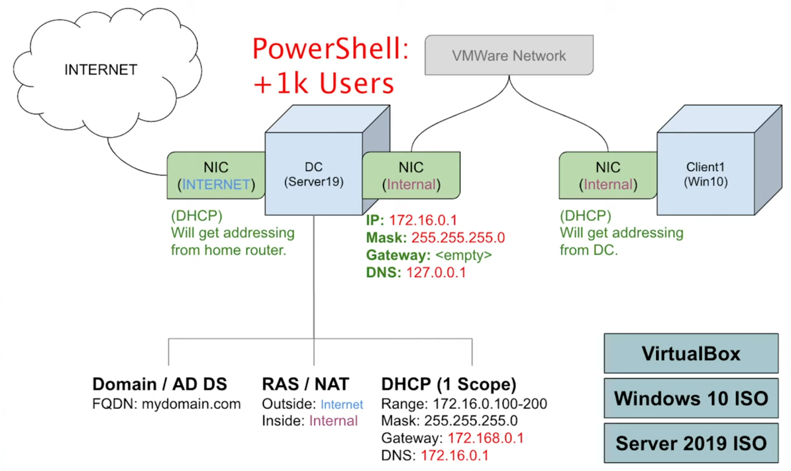

### Key Components
1. **DC (Domain Controller)**:
   - Runs Active Directory Domain Services (AD DS).
   - Provides DNS and DHCP for the internal network.
   - IP: `172.16.0.1`

2. **Client1 (Windows 10)**:
   - Joins the domain and communicates with the Domain Controller.
   - Receives IP and DNS configuration from the Domain Controller.

3. **DHCP Scope**:
   - IP Range: `172.16.0.100` to `172.16.0.200`

4. **RAS/NAT**:
   - Enables internal machines to access the internet via the Domain Controller.

This setup simulates a real-world environment for hands-on practice in Active Directory, DHCP, and PowerShell scripting.

---

## Objectives
- Install and configure Oracle VirtualBox.
- Set up a Windows Server virtual machine.
- Promote the server to a Domain Controller.
- Manage Active Directory users using PowerShell scripts.

---

## Skills Demonstrated
- **Virtualization**: Setting up and managing virtual machines.
- **Windows Server Administration**: Installing and configuring Windows Server roles.
- **Active Directory**: Configuring and managing Active Directory Domain Services.
- **PowerShell Scripting**: Automating user management tasks.

---

## Tools and Technologies
- **Oracle VirtualBox**: Virtualization platform.
- **Windows Server**: Operating system for the Domain Controller.
- **Active Directory Domain Services (AD DS)**: Directory service for Windows domain networks.
- **PowerShell**: Scripting language for task automation.

---

## Setup Instructions

### 1. Install Oracle VirtualBox
Download and install [Oracle VirtualBox](https://www.virtualbox.org/).

### 2. Set Up Windows Server VM
- Create a new virtual machine and install Windows Server.
- Configure network settings and ensure the VM has internet access.

### 3. Promote to Domain Controller
- Install the Active Directory Domain Services (AD DS) role.
- Promote the server to a Domain Controller and create a new domain.

### 4. Manage Users with PowerShell
- Write PowerShell scripts to add, modify, and delete users in Active Directory.

---

## Results
- Successfully set up a virtualized environment with Active Directory.
- Automated user management tasks using PowerShell scripts.

---

## Conclusion
This project provided hands-on experience in setting up an Active Directory environment, enhancing skills in virtualization, server administration, and scripting.

---

## Screenshots

### Download VirtualBox and Windows Server 2022 ISO
- **Download VirtualBox:** [www.virtualbox.org](https://www.virtualbox.org)
  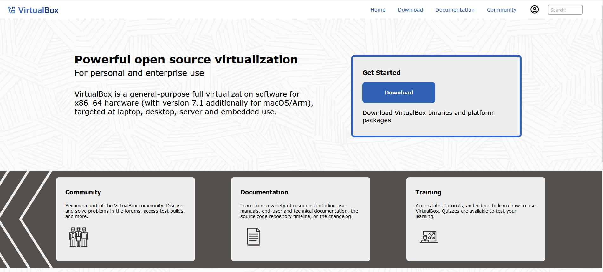

- **Download Windows Server 2022 ISO:** [Microsoft Evaluation Center](https://www.microsoft.com/en-us/evalcenter/evaluate-windows-server-2022)
  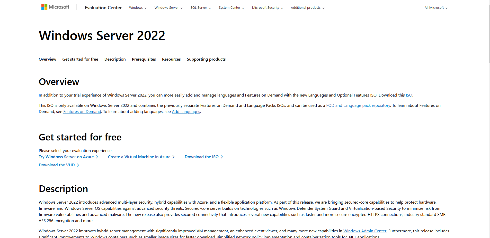

---

### VirtualBox Installed
This screenshot shows that Oracle VirtualBox is installed and ready for use:

---

### Virtual Machine Settings
These screenshots show the hardware, hard disk, and storage settings for the Windows Server 2022 VM:

#### Hardware Settings
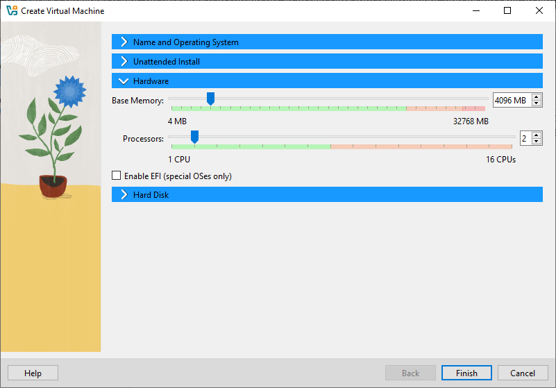

#### Hard Disk Settings
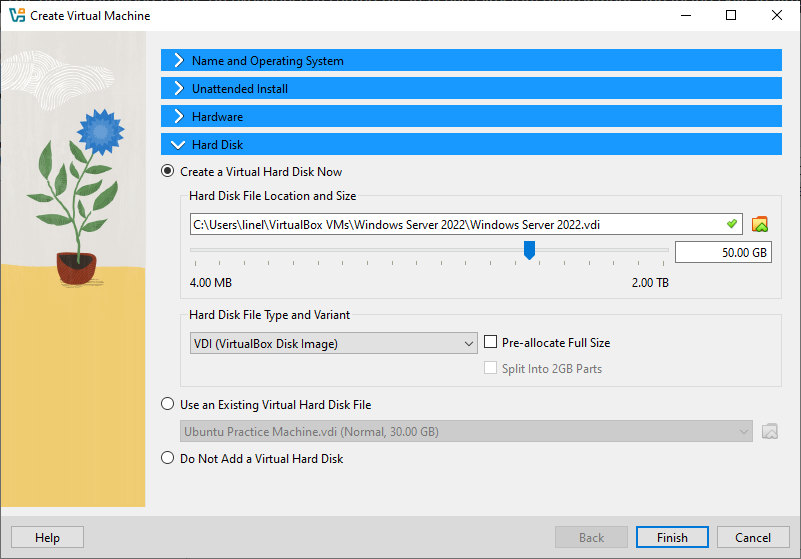

#### Storage/ISO Settings
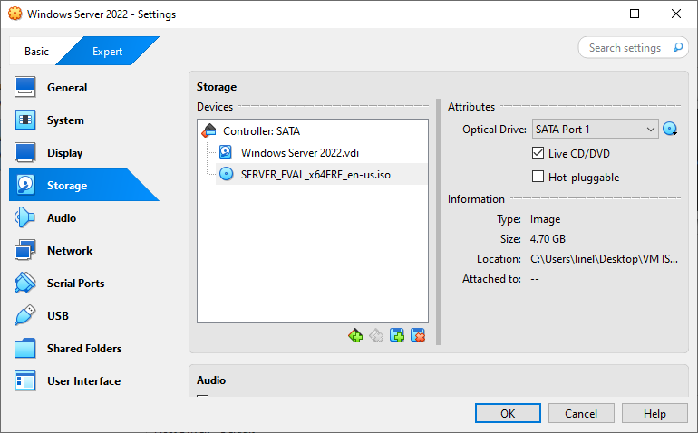

---

### Windows Server Installation

#### Select Custom Install
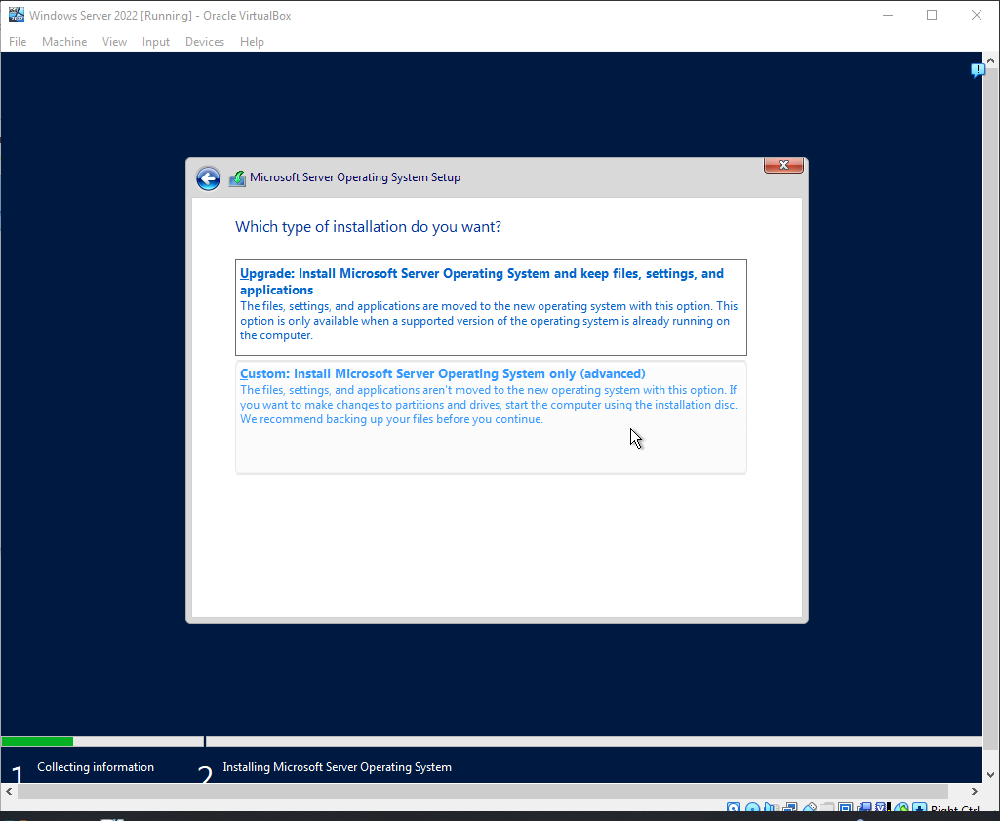

#### Edition Selection
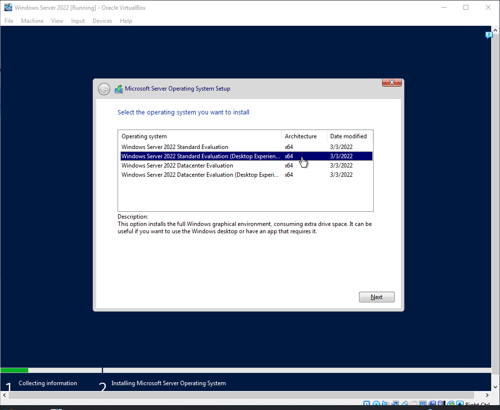

#### Disk Selection
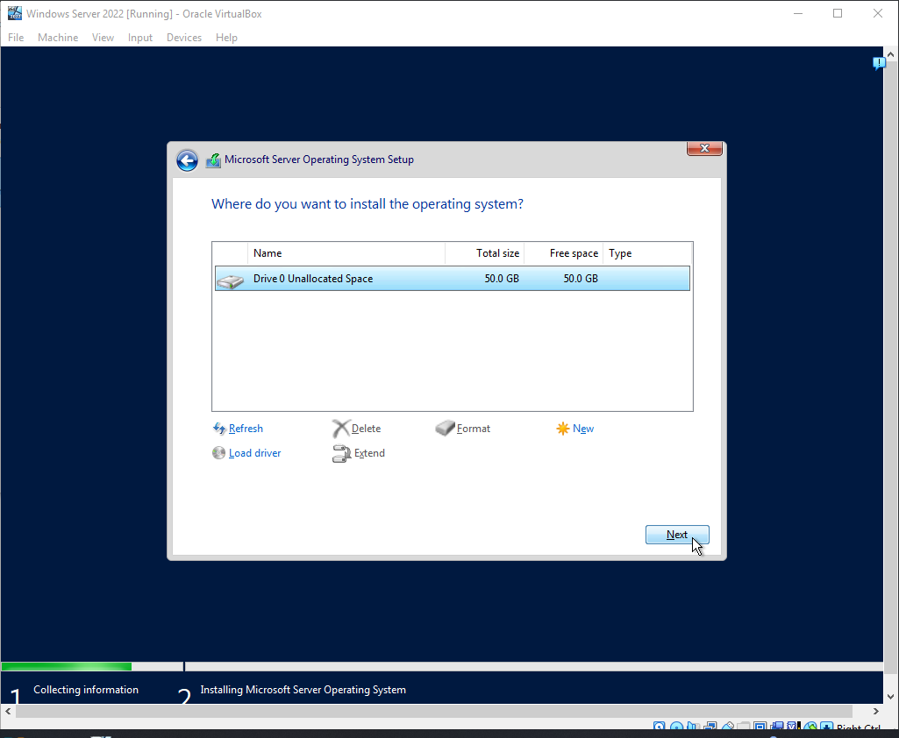

#### Windows Server 2022 GUI
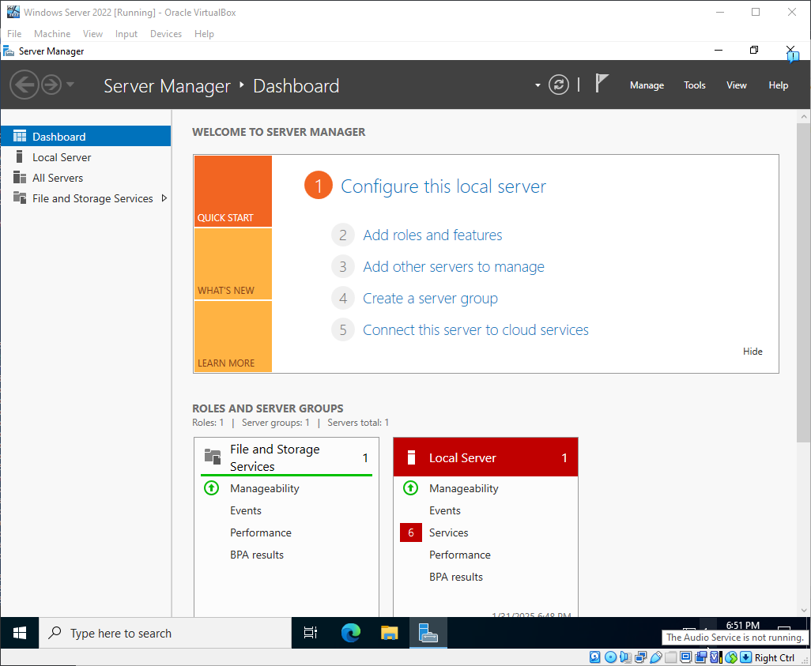

---

## Configuring Network Adapters in VirtualBox

### Step 1: Access VirtualBox Network Settings
1. Open **VirtualBox** and select your **Windows Server 2022 VM**.
2. Click on **Settings** (gear icon) → Navigate to the **Network** tab.

### Step 2: Configure Adapter 1 (NAT)
1. Under **Adapter 1**, ensure the following settings:
   - **Enable Network Adapter**: Checked.
   - **Attached to**: NAT.

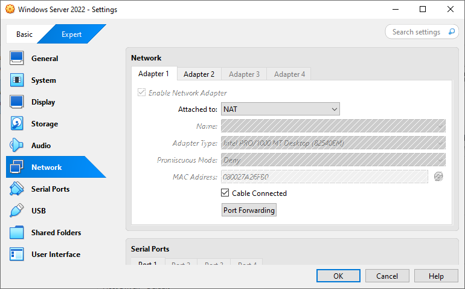

### Step 3: Configure Adapter 2 (Internal Network)
1. Click on **Adapter 2** and configure the following:
   - **Enable Network Adapter**: Checked.
   - **Attached to**: Internal Network.

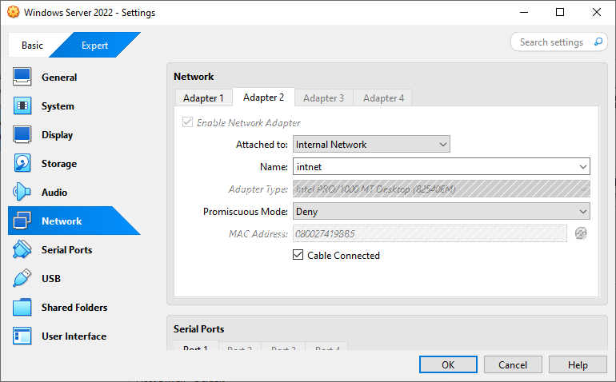

---

## Configuring Network Adapters in Windows Server

### Step 1: Access the Network Menu
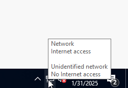

### Step 2: Open Network & Internet Settings
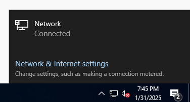

### Step 3: Access Change Adapter Options
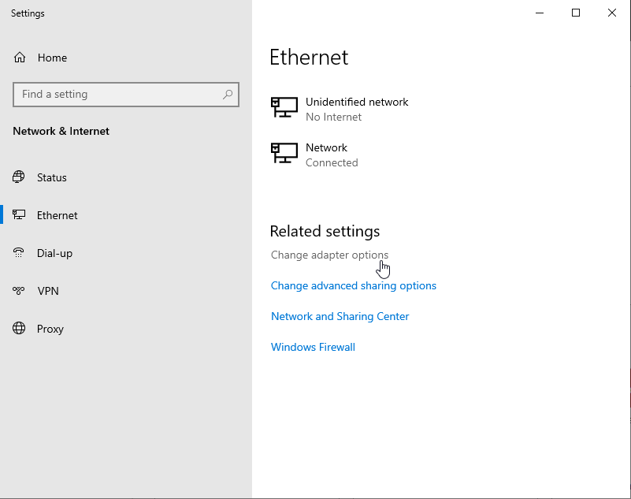

---

Let me know if you need any changes or further assistance! 🚀

---

## Configuring Network Adapters in Windows Server

### Step 1: Access the Network Menu
1. Navigate to the **system tray** at the bottom-right corner of the screen.
2. Locate the **network icon** (it may appear as a globe or Wi-Fi symbol).
3. **Right-click** the network icon to open the menu.

---

### Step 2: Open Network & Internet Settings
1. From the network menu, click on **Network & Internet settings**.
2. This opens the Windows Settings panel with network-related options.

---

### Step 3: Access Change Adapter Options
1. In the **Network & Internet Settings** window, select **Ethernet** from the left-hand panel.
2. Under **Related settings**, click **Change adapter options**.
3. This opens the **Network Connections** window.

---

### Step 4: View Available Network Adapters
1. In the **Network Connections** window, you’ll see a list of all available adapters.
   - Each adapter shows its name and current status (e.g., `Network` or `Unidentified network`).

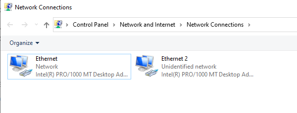

---

### Step 5: Identify the Internet-Connected Adapter
1. Right-click on each adapter and select **Status** to view its connection details.
2. In the **Ethernet Status** window, click **Details...** to see network properties.

**Screenshots:**
- **Checking Adapter Status:**
  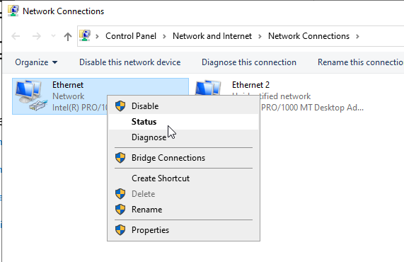

- **Network Connection Details:**
  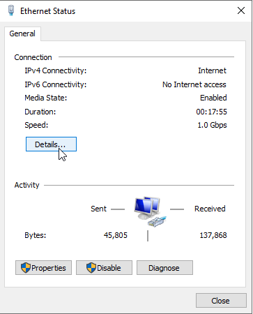

---

### Step 6: Verify the Internet-Connected Adapter
- Look for the following details in the **Network Connection Details** window:
  1. **IPv4 Address**: `10.0.2.15` (indicates this adapter is active on the network).
  2. **Default Gateway**: `10.0.2.2` (confirms this adapter is used to route traffic to the internet).
  3. **DHCP Enabled**: `Yes` (shows the adapter is receiving its IP address dynamically).

**Explanation:**
- The adapter with a valid **IPv4 Address** and a configured **Default Gateway** is connected to the internet.
- In this case, the adapter with IP `10.0.2.15` is the internet-connected adapter.

---

### Step 7: Rename the Adapters for Easy Identification
1. In the **Network Connections** window, right-click each adapter and select **Rename**.
2. Rename the adapters as follows:
   - **Adapter connected to the internet:** `_INTERNET_`.
   - **Adapter for internal communication:** `X_internal_X`.

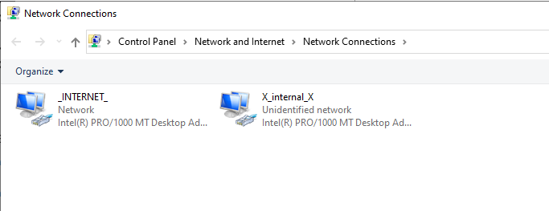

---

### Benefits of Renaming Adapters
1. **Improved Clarity**:
   - Clearly distinguishes between the external (internet-facing) and internal adapters.
2. **Prevents Configuration Errors**:
   - Makes it easier to assign services like DHCP, DNS, or Active Directory roles.
