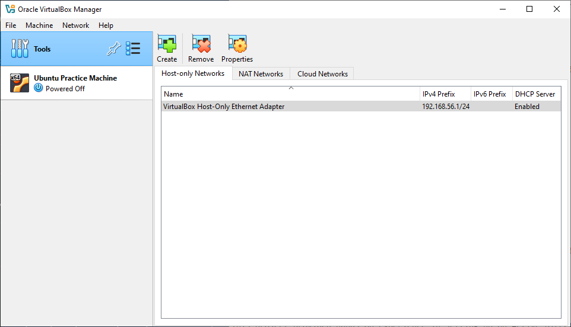

# Active Directory Home Lab

## Overview
This project involves setting up a home lab using Oracle VirtualBox to install and configure Active Directory. The lab includes creating a Windows Server virtual machine, promoting it to a Domain Controller, and managing users with PowerShell.

## Lab Architecture

The following diagram illustrates the network topology and key components of this Active Directory lab environment:

### Key Components
1. **DC (Domain Controller)**:
   - Runs Active Directory Domain Services (AD DS).
   - Provides DNS and DHCP for the internal network.
   - IP: `172.16.0.1`

2. **Client1 (Windows 10)**:
   - Joins the domain and communicates with the Domain Controller.
   - Receives IP and DNS configuration from the Domain Controller.

3. **DHCP Scope**:
   - IP Range: `172.16.0.100` to `172.16.0.200`

4. **RAS/NAT**:
   - Enables internal machines to access the internet via the Domain Controller.

This setup simulates a real-world environment for hands-on practice in Active Directory, DHCP, and PowerShell scripting.

## Objectives
- Install and configure Oracle VirtualBox.
- Set up a Windows Server virtual machine.
- Promote the server to a Domain Controller.
- Manage Active Directory users using PowerShell scripts.

## Skills Demonstrated
- **Virtualization**: Setting up and managing virtual machines.
- **Windows Server Administration**: Installing and configuring Windows Server roles.
- **Active Directory**: Configuring and managing Active Directory Domain Services.
- **PowerShell Scripting**: Automating user management tasks.

## Tools and Technologies
- **Oracle VirtualBox**: Virtualization platform.
- **Windows Server**: Operating system for the Domain Controller.
- **Active Directory Domain Services (AD DS)**: Directory service for Windows domain networks.
- **PowerShell**: Scripting language for task automation.

## Setup Instructions

### 1. Install Oracle VirtualBox
Download and install [Oracle VirtualBox](https://www.virtualbox.org/).

### 2. Set Up Windows Server VM
- Create a new virtual machine and install Windows Server.
- Configure network settings and ensure the VM has internet access.

### 3. Promote to Domain Controller
- Install the Active Directory Domain Services (AD DS) role.
- Promote the server to a Domain Controller and create a new domain.

### 4. Manage Users with PowerShell
- Write PowerShell scripts to add, modify, and delete users in Active Directory.

## Results
- Successfully set up a virtualized environment with Active Directory.
- Automated user management tasks using PowerShell scripts.

## Conclusion
This project provided hands-on experience in setting up an Active Directory environment, enhancing skills in virtualization, server administration, and scripting.

## Screenshots

### Download VirtualBox and Windows Server 2022 ISO
- **Download VirtualBox:** [www.virtualbox.org](https://www.virtualbox.org)
  

- **Download Windows Server 2022 ISO:** [Microsoft Evaluation Center](https://www.microsoft.com/en-us/evalcenter/evaluate-windows-server-2022)
  

### VirtualBox Installed
This screenshot shows that Oracle VirtualBox is installed and ready for use:

### Virtual Machine Settings
These screenshots show the hardware, hard disk, and storage settings for the Windows Server 2022 VM:

#### Hardware Settings
This screenshot shows the hardware configuration, including RAM and CPU allocation:

#### Hard Disk Settings
This screenshot shows the dynamically allocated storage settings for the VM:

#### Storage/ISO Settings
This screenshot shows the Windows Server 2022 ISO file attached to the VM:

## Windows Server Installation

### Select Custom Install

### Edition Selection

### Disk Selection

### Windows Server 2022 GUI

