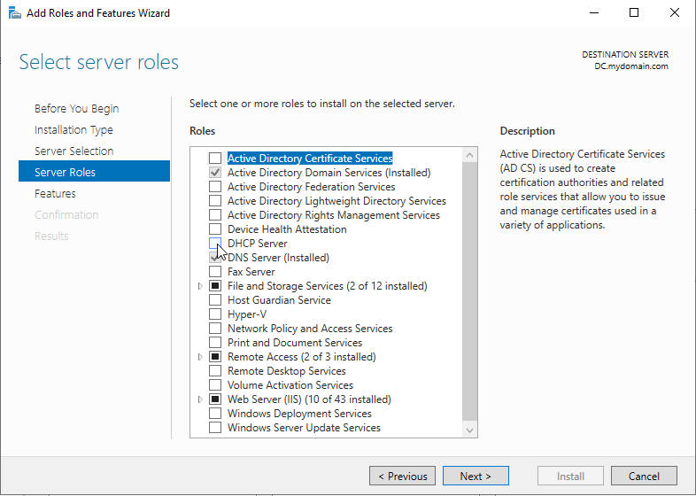
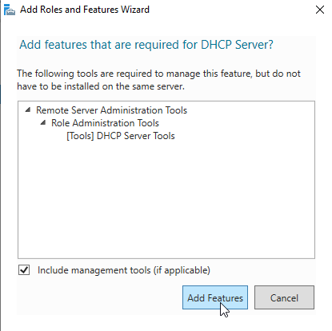
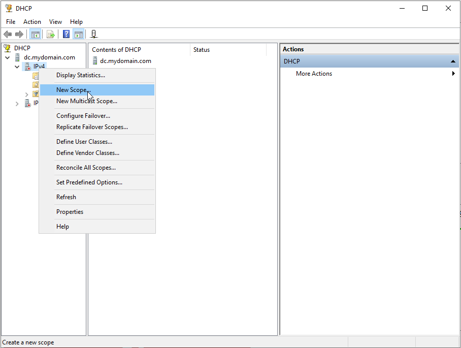
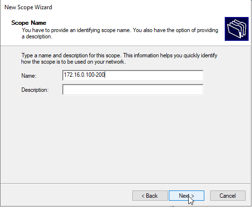
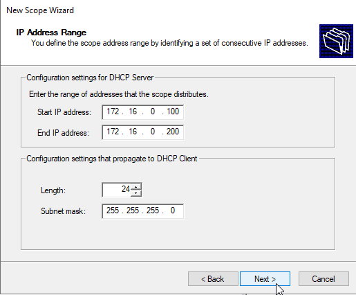
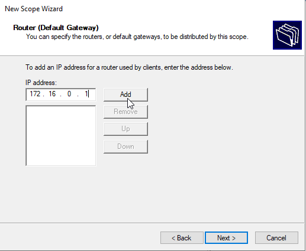
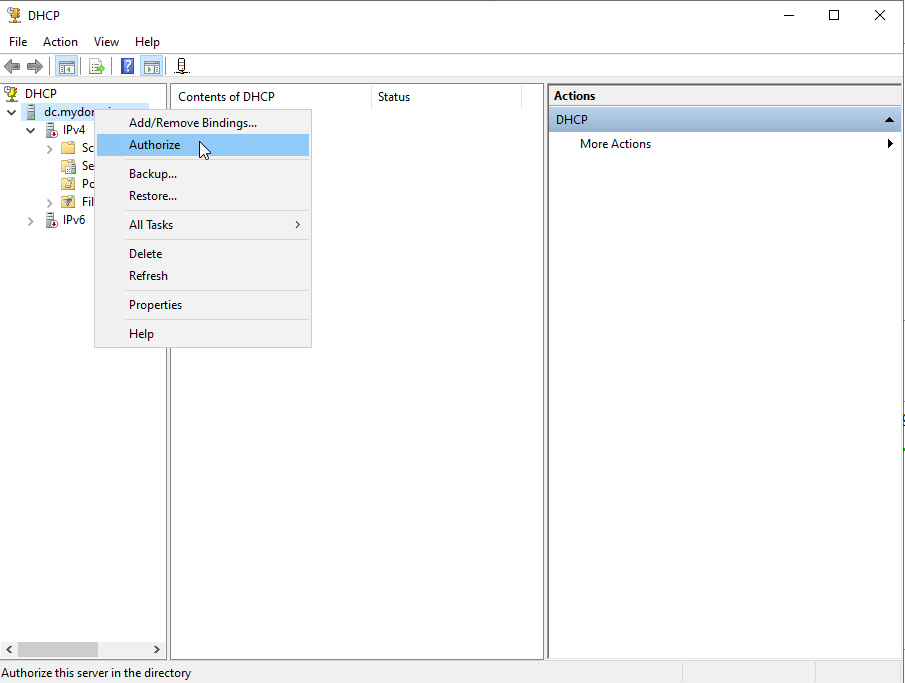
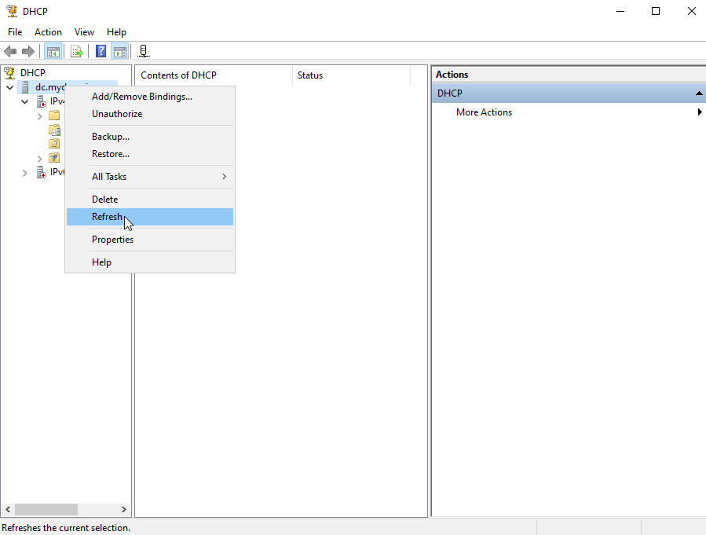

# Setting Up DHCP with the Domain Controller

## Table of Contents
- [Installing and Configuring DHCP Server](#installing-and-configuring-dhcp-server)
- [Configuring a DHCP Scope on Windows Server](#configuring-a-dhcp-scope-on-windows-server)
- [Next Step: ](docs/.md)
- [Back to Active Directory Home Lab README](../README.md)
##

## Installing and Configuring DHCP Server
Follow these steps to install and configure the DHCP Server role on Windows Server:

---

### Step 1: Select Role Services
(refer to [Installing Active Directory Domain Services (AD DS)](/docs/usingAD.md#step-1-open-server-manager-and-select-add-roles-and-features) for adding roles and features)

1. In the **Add Roles and Features Wizard**, click **Next** until you reach the **Server Roles** page.
2. Scroll through the list and select **DHCP Server**.

   

3. A dialog will appear prompting you to add additional features required for the DHCP Server role. Click **Add Features**.

   

4. Click **Next** and continue through the wizard.

---

## Step 2: Confirm Installation Selections

1. On the **Confirmation** page, verify that the **DHCP Server** role and its required features are listed.
2. Click **Install** to begin the installation process.

---

## Configuring a DHCP Scope on Windows Server

### Step 1: Open DHCP Manager
1. Open **Server Manager**.
2. Navigate to **Tools** and select **DHCP**.

---

### Step 2: Create a New Scope
1. In the **DHCP Manager**, expand your server under **IPv4**.
2. Right-click **IPv4** and select **New Scope**.

---

### Step 3: Name the Scope
1. In the **New Scope Wizard**, enter a name for the scope. For example: `172.16.0.100-200`.
2. Optionally, add a description.
3. Click **Next**.

---

### Step 4: Define IP Address Range
1. Enter the range of IP addresses to distribute:
   - **Start IP Address:** `172.16.0.100`
   - **End IP Address:** `172.16.0.200`
2. Set the **Length** to `24` and the **Subnet mask** to `255.255.255.0`.
3. Click **Next**.

---

### Step 5: Configure Default Gateway
1. Add the router's IP address to the scope:
   - **IP Address:** `172.16.0.1`
2. Click **Add**, then **Next** until you get through the rest of the **New Scope Wizard**.

---

### Step 6: Authorize the DHCP Server
1. In **DHCP Manager**, right-click your server name and select **Authorize**.
2. Wait a few seconds, then right-click the server name again and click **Refresh** to verify the status.

---

### Step 7: Verify DHCP Server Status
1. Ensure the DHCP server is authorized and running.
2. You can now distribute IP addresses to clients within the configured scope.

---

### Additional Notes
- Ensure that your DHCP server is properly configured to communicate with other devices on the network.
- If there are issues, verify that the server is authorized and that the correct settings were applied.
