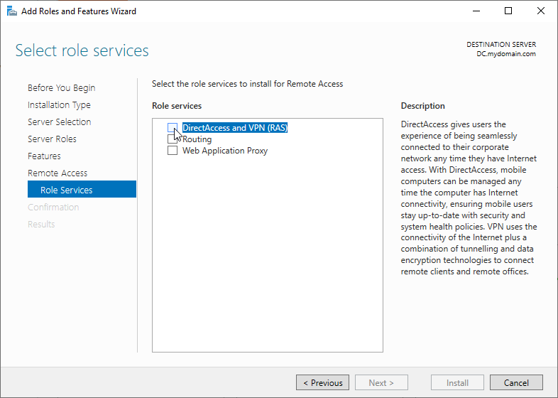
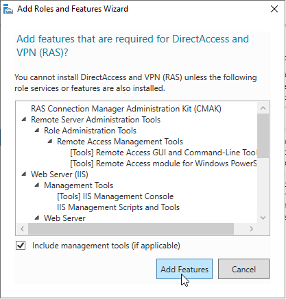
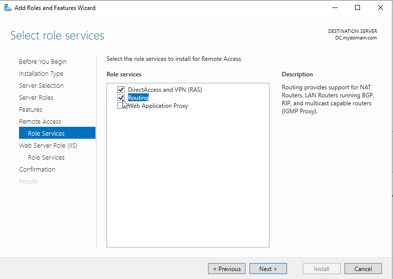
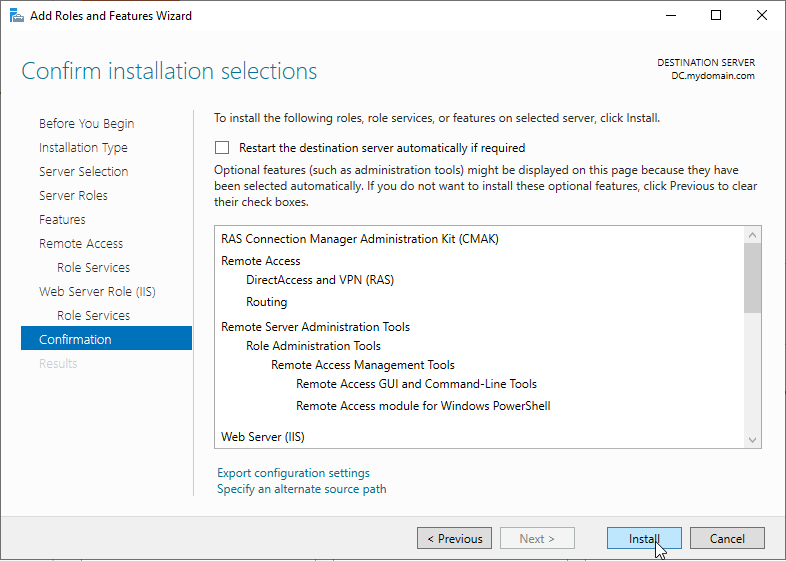
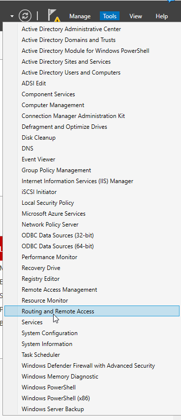
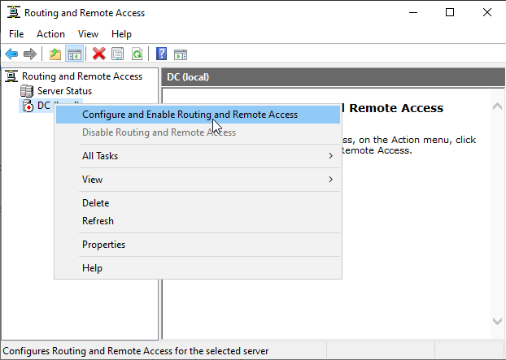
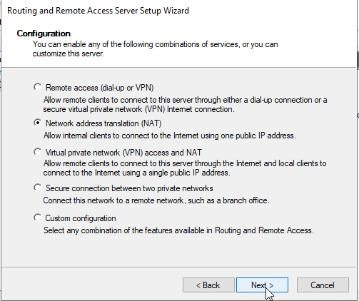
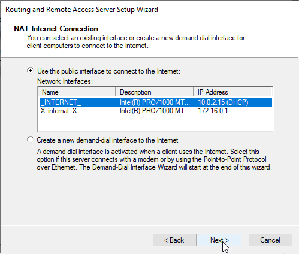
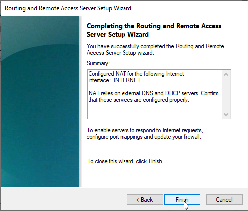

# Setting up NAS/RAS

## Table of Contents
- [Configuring NAT and Remote Access Service (RAS)](#step-1-select-role-services-refer-to-installing-active-directory-domain-services-ad-ds-for-adding-roles-and-features)
- [Configuring NAT and Routing with Remote Access]

## Configuring NAT and Remote Access Service (RAS)
### Step 1: Select Role Services
(refer to [Installing Active Directory Domain Services (AD DS)](/docs/usingAD.md#step-1-open-server-manager-and-select-add-roles-and-features) for adding roles and features)

1. Open the **Add Roles and Features Wizard**.
2. Navigate to the **Role Services** step under **Remote Access**.
3. Select the following role services:
   - **DirectAccess and VPN (RAS)**
   - **Routing**

---

### Step 2: Add Required Features

1. When prompted, click **Add Features** to include the required management tools for DirectAccess and VPN (RAS).
2. Ensure that **Include management tools (if applicable)** is checked.
3. Click **Add Features**.

---

### Step 3: Confirm Role Services

1. Ensure that the following options are selected:
   - **DirectAccess and VPN (RAS)**
   - **Routing**
2. If additional role services are needed (e.g., **Web Application Proxy**), you may select them as well.
3. Click **Next** to until you get to **Confirmation**.

---

### Step 4: Confirm Installation Selections

1. Review the installation selections to ensure all necessary features and roles are included:
   - **RAS Connection Manager Administration Kit (CMAK)**
   - **Remote Access Management Tools**
   - **Remote Access module for Windows PowerShell**
2. Click **Install** to begin the installation process.

---

## Conclusion

Once the installation is complete, you can configure your Remote Access and NAT settings as required to provide connectivity and routing for your network environment.

# Configuring NAT and Routing with Remote Access

---

## Step 1: Access Routing and Remote Access
1. Open **Server Manager**.
2. Click on **Tools** and select **Routing and Remote Access** from the dropdown menu.

   

---

## Step 2: Enable and Configure Routing and Remote Access
1. In the **Routing and Remote Access** window, right-click the server name and select **Configure and Enable Routing and Remote Access**.

   

---

## Step 3: Start the Setup Wizard
1. The **Routing and Remote Access Server Setup Wizard** will open.
2. Select **Network address translation (NAT)** and click **Next**.

   

---

## Step 4: Configure the Internet Connection
1. Choose the public interface connected to the Internet.
2. In the example below, `_INTERNET_` (10.0.2.15) is selected.
3. Click **Next** to proceed.

   

---

## Step 5: Complete the Setup
1. Review the summary of the configuration.
2. Click **Finish** to complete the setup.

   

---

## Final Notes
- Ensure that the **Windows Firewall** is configured to allow ports required for Routing and Remote Access.
- NAT relies on external DNS and DHCP servers. Verify that these services are running and configured properly.

This configuration enables NAT and routing for internal clients to access the Internet via the public interface on your Windows Server.

[🔝 Back to Table of Contents](#table-of-contents)
