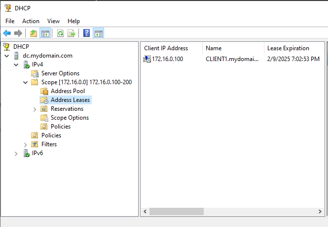

Joining Domain From CLIENT1

## Table of Contents
- [Renaming PC to CLIENT1 and Joining the Domain](#renaming-pc-to-client1-and-joining-the-domain)
- [Back to Active Directory Home Lab README](../README.md)

## Renaming PC to CLIENT1 and Joining the Domain

Follow these steps to rename the PC to `CLIENT1` and join it to the `mydomain.com` domain:

1. **Open System Properties**:
   - Press `Win + R` to open the Run dialog.
   - Type `sysdm.cpl` and press `Enter` to open the System Properties window.

2. **Navigate to the Computer Name Tab**:
   - In the System Properties window, click on the **Computer Name** tab.

3. **Click on Change**:
   - Under the "Computer name, domain, and workgroup settings" section, click the **Change** button.

4. **Rename the PC**:
   - In the "Computer Name" field, enter `CLIENT1` as the new name.

5. **Join the Domain**:
   - Under the "Member of" section, select the **Domain** option.
   - Enter `mydomain.com` as the domain name.

6. **Apply the Changes**:
   - Click **OK** to confirm the new computer name and domain.
   - A prompt will appear asking for credentials to join the domain. Enter the domain administrator's username and password, then click **OK**.

7. **Confirm Domain Join**:
   - After successfully joining the domain, a dialog will appear welcoming you to the `mydomain.com` domain. Click **OK**.

8. **Confirming Connection to DC**
   - Finally, we can confirm the connection of CLIENT1 to the Domain Controller from the Windows Server 2022 VM

---

[🔝 Back to Table of Contents](#table-of-contents)

##

[Back to Active Directory Home Lab README](../README.md)
##