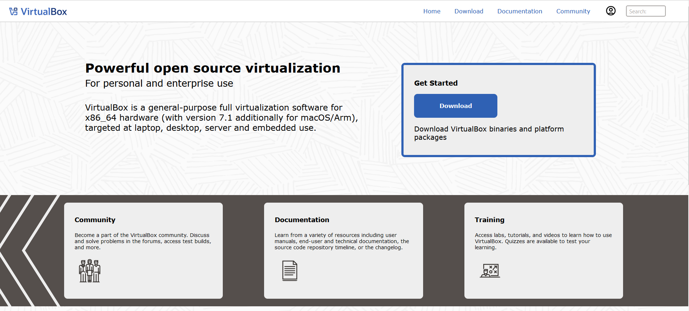
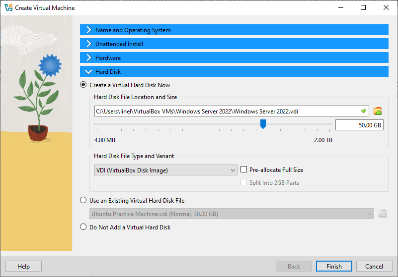
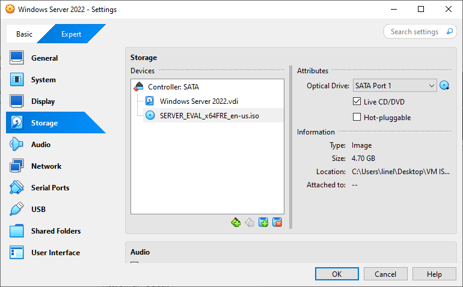
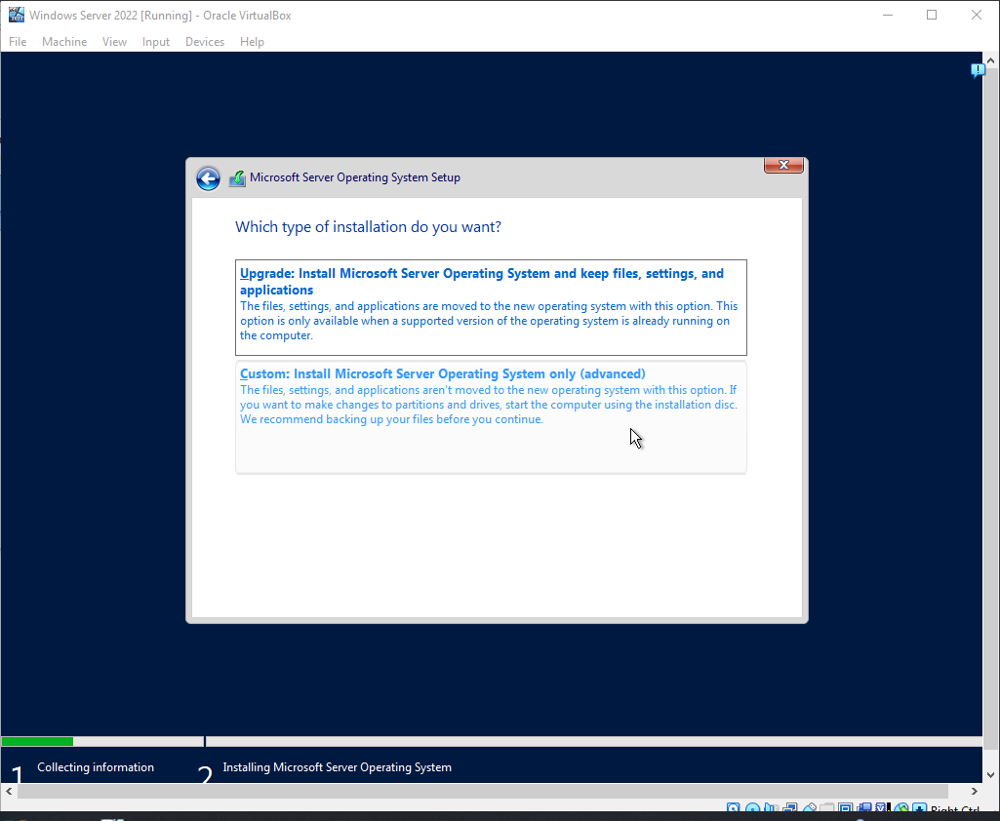
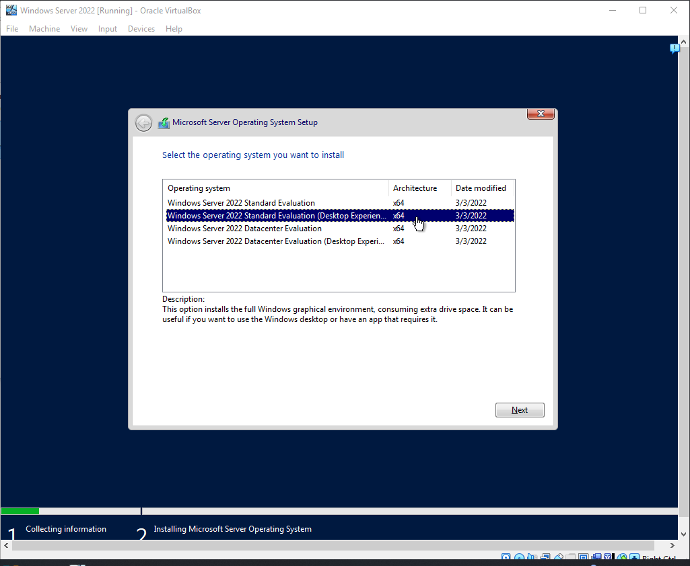
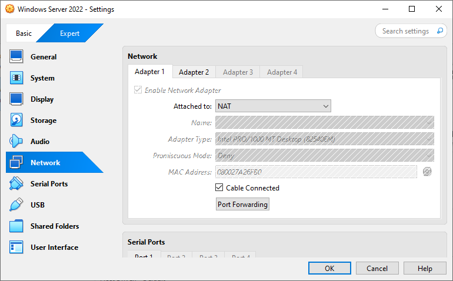
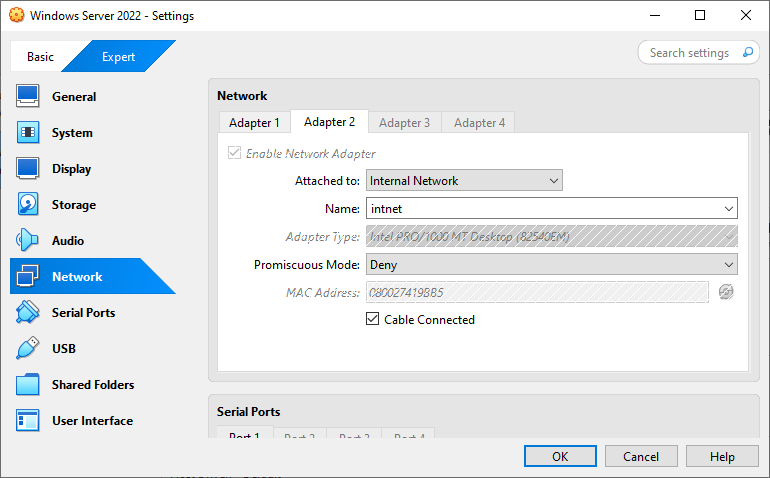
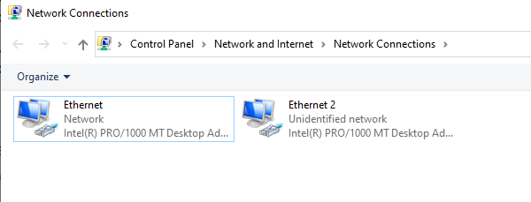
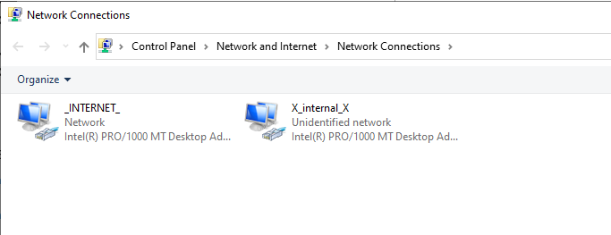

# Setup Instructions

## Table of Contents
- [VirtualBox and Windows Server 2022 Downloads](#download-virtualbox-and-windows-server-2022-iso)
- [Virtual Machine Settings](#virtual-machine-settings)
- [Windows Server 2022 Installation](#windows-server-2022-installation)
- [Configuring Network Adapters in VirtualBox](#configuring-network-adapters-in-virtualbox)
- [Configuring Network Adapters in Windows Server](#configuring-network-adapters-in-windows-server)
- [Configure IPv4 Settings for Internal Adapter](#configure-ipv4-settings-for-internal-adapter)
- [Setting Up the "Client1" VM](#setting-up-the-client1-vm-for-the-active-directory-lab)
- [Networking Configuration for "Client1"](#networking-configuration-for-client1)
- [Install Windows 10 Pro on the VM](#install-windows-10-pro-on-the-vm)
- [Renaming PC to CLIENT1 and Joining the Domain](#renaming-pc-to-client1-and-joining-the-domain)
- [Next Step: Using Active Directory](docs/usingAD.md)
- [Back to Active Directory Home Lab README](../README.md)
##

## 1. Install Oracle VirtualBox
Download and install [Oracle VirtualBox](https://www.virtualbox.org/).

## 2. Set Up Windows Server VM
- Create a new virtual machine and install Windows Server.
- Configure network settings and ensure the VM has internet access.

---

## Guide with Screenshots

### Download VirtualBox and Windows Server 2022 ISO
- **Download VirtualBox:** [www.virtualbox.org](https://www.virtualbox.org)
  

- **Download Windows Server 2022 ISO:** [Microsoft Evaluation Center](https://www.microsoft.com/en-us/evalcenter/evaluate-windows-server-2022)
  

---

### VirtualBox Installed
This screenshot shows that Oracle VirtualBox is installed and ready for use:

---

### Virtual Machine Settings
These screenshots show the hardware, hard disk, and storage settings for the Windows Server 2022 VM:

#### Hardware Settings

#### Hardware Settings

#### Hard Disk Settings

#### Storage/ISO Settings

---

### Windows Server 2022 Installation

#### Start the VM

#### Select Custom Install

#### Edition Selection

#### Disk Selection

#### Windows Server 2022 GUI

---

## Configuring Network Adapters in VirtualBox

### Step 1: Access VirtualBox Network Settings
1. Open **VirtualBox** and select your **Windows Server 2022 VM**.
2. Click on **Settings** (gear icon) → Navigate to the **Network** tab.

### Step 2: Configure Adapter 1 (NAT)
1. Under **Adapter 1**, ensure the following settings:
   - **Enable Network Adapter**: Checked.
   - **Attached to**: NAT.

### Step 3: Configure Adapter 2 (Internal Network)
1. Click on **Adapter 2** and configure the following:
   - **Enable Network Adapter**: Checked.
   - **Attached to**: Internal Network.

---

## Configuring Network Adapters in Windows Server

### Step 1: Access the Network Menu
1. Navigate to the **system tray** at the bottom-right corner of the screen.
2. Locate the **network icon** (it may appear as a globe or Wi-Fi symbol).
3. **Right-click** the network icon to open the menu.

---

### Step 2: Open Network & Internet Settings
1. From the network menu, click on **Network & Internet settings**.
2. This opens the Windows Settings panel with network-related options.

---

### Step 3: Access Change Adapter Options
1. In the **Network & Internet Settings** window, select **Ethernet** from the left-hand panel.
2. Under **Related settings**, click **Change adapter options**.
3. This opens the **Network Connections** window.

---

### Step 4: View Available Network Adapters
1. In the **Network Connections** window, you’ll see a list of all available adapters.
   - Each adapter shows its name and current status (e.g., `Network` or `Unidentified network`).

---

### Step 5: Identify the Internet-Connected Adapter
1. Right-click on each adapter and select **Status** to view its connection details.
2. In the **Ethernet Status** window, click **Details...** to see network properties.

**Checking Adapter Status:**

**Network Connection Details:**

---

### Step 6: Verify the Internet-Connected Adapter
- Look for the following details in the **Network Connection Details** window:
  1. **IPv4 Address**: `10.0.2.15` (indicates this adapter is active on the network).
  2. **Default Gateway**: `10.0.2.2` (confirms this adapter is used to route traffic to the internet).
  3. **DHCP Enabled**: `Yes` (shows the adapter is receiving its IP address dynamically).

**Explanation:**
- The adapter with a valid **IPv4 Address** and a configured **Default Gateway** is connected to the internet.
- In this case, the adapter with IP `10.0.2.15` is the internet-connected adapter.

---

### Step 7: Rename the Adapters for Easy Identification
1. In the **Network Connections** window, right-click each adapter and select **Rename**.
2. Rename the adapters as follows:
   - **Adapter connected to the internet:** `_INTERNET_`.
   - **Adapter for internal communication:** `X_internal_X`.

---

### Benefits of Renaming Adapters
1. **Improved Clarity**:
   - Clearly distinguishes between the external (internet-facing) and internal adapters.
2. **Prevents Configuration Errors**:
   - Makes it easier to assign services like DHCP, DNS, or Active Directory roles.

---

### **Configure IPv4 Settings for Internal Adapter**

#### Step 1: Open Properties for the Internal Network Adapter
1. Navigate to **Network Connections**.
2. Right-click on the adapter labeled `X_internal_X` and select **Properties**.

---

#### Step 2: Access IPv4 Settings
1. In the **Properties** window, scroll down to **Internet Protocol Version 4 (TCP/IPv4)**.
2. Select it and click the **Properties** button.

---

#### Step 3: Set a Static IP Address
1. In the **IPv4 Properties** window:
   - Select **Use the following IP address**.
   - Enter the following values:
     - **IP Address**: `172.16.0.1`
     - **Subnet Mask**: `255.255.255.0`
     - **Default Gateway**: Leave blank.
   - Select **Use the following DNS server addresses**.
     - **Preferred DNS Server**: `127.0.0.1`
     - **Alternate DNS Server**: Leave blank.

2. Click **OK** to save your changes.

### **Explanation**
- **Why Use a Static IP?**
  - The internal network adapter needs a consistent IP address (`172.16.0.1`) to serve as the Domain Controller (DC) and DNS server.
- **Why Set `127.0.0.1` as DNS?**
  - `127.0.0.1` is the **localhost address**, ensuring the server resolves DNS queries locally.

---

## Setting Up the "Client1" VM

### Downloading the Windows 10 64-bit ISO

To set up a virtual machine or create bootable installation media, follow these steps to download the Windows 10 64-bit ISO:

1. **Navigate to the Microsoft Software Download Page**:
   - Go to the official [Microsoft Software Download Page](https://www.microsoft.com/software-download/windows10).

2. **Scroll to the "Create Windows 10 Installation Media" Section**:
   - Locate the section titled **Create Windows 10 installation media**.

3. **Click "Download Now"**:
   - Click the **Download Now** button to download the Media Creation Tool. Refer to the screenshot below for guidance:

   

4. **Run the Media Creation Tool**:
   - Once downloaded, open the Media Creation Tool and follow the prompts to:
     - Select your preferred language.
     - Choose the 64-bit version of Windows 10.
     - Save the ISO file to your computer.

5. **Save the ISO File**:
   - When prompted, choose a location on your computer to save the ISO file for future use.

---

To set up the "Client1" VM, you will follow a similar process to the setup for the server VM. Please refer to the **Server VM Setup** section for detailed instructions on installing the operating system, configuring basic settings, and enabling essential features. Below, we will highlight the unique configurations required for the Client1 VM.

### Networking Configuration for "Client1"

The networking configuration ensures the Client1 VM can communicate with the server VM on the internal network. Follow these steps:

1. Open the settings for the Client1 VM in VirtualBox.
2. Navigate to the **Network** section.
3. Configure the following settings for **Adapter 1**:
   - **Enable Network Adapter**: Checked
   - **Attached to**: Internal Network
   - **Name**: `intnet` (or the same name used for your server VM's internal network)
   - **Adapter Type**: Intel PRO/1000 MT Desktop (82540EM)
   - **Promiscuous Mode**: Deny
   - **MAC Address**: Leave as auto-generated or adjust as needed.
   - **Cable Connected**: Checked

4. Save the settings by clicking **OK**.

Below is a screenshot of the network configuration for the Client1 VM:

### Additional Notes

- If any other configurations, such as disk or system settings, are required, refer to the **Server VM Setup** section for guidance.
- After completing the setup, ensure the Client1 VM is properly connected to the internal network by testing connectivity to the server VM (e.g., using the `ping` command from the Client1 VM).
- The Client1 VM will act as a client within the Active Directory environment, allowing you to test user logins, group policies, and other domain-related tasks.

---

## Install Windows 10 Pro on the VM

1. **Attach the ISO to the Virtual Machine**:
   - Create a new virtual machine.
   - Go to the VM settings and attach the Windows 10 ISO to the virtual DVD drive.

2. **Start the Virtual Machine**:
   - Power on the virtual machine.
   - The VM will boot from the attached ISO and launch the Windows 10 installation process.
   - Choose **I Don’t Have a Product Key** to proceed with installation without activating Windows.
   
4. **Select the Edition**:
   - Choose **Windows 10 Pro** from the list of available editions.

   
5. **Complete the Setup**
   - Select **Custom** for the install type, select the drive, press **Next**, and complete installation.
---

## Renaming PC to CLIENT1 and Joining the Domain

Follow these steps to rename the PC to `CLIENT1` and join it to the `mydomain.com` domain:

1. **Open System Properties**:
   - Press `Win + R` to open the Run dialog.
   - Type `sysdm.cpl` and press `Enter` to open the System Properties window.

2. **Navigate to the Computer Name Tab**:
   - In the System Properties window, click on the **Computer Name** tab.

3. **Click on Change**:
   - Under the "Computer name, domain, and workgroup settings" section, click the **Change** button.

4. **Rename the PC**:
   - In the "Computer Name" field, enter `CLIENT1` as the new name.

5. **Join the Domain**:
   - Under the "Member of" section, select the **Domain** option.
   - Enter `mydomain.com` as the domain name.

6. **Apply the Changes**:
   - Click **OK** to confirm the new computer name and domain.
   - A prompt will appear asking for credentials to join the domain. Enter the domain administrator's username and password, then click **OK**.

7. **Confirm Domain Join**:
   - After successfully joining the domain, a dialog will appear welcoming you to the `mydomain.com` domain. Click **OK**.

8. **Confirming Connection to DC**
   - Finally, we can confirm out connection of CLIENT1 to our Domain Controller from our Windows Server 2022 VM

---

[🔝 Back to Table of Contents](#table-of-contents)

##
[Next Step: Using Active Directory](docs/usingAD.md)

[Back to Active Directory Home Lab README](../README.md)
##