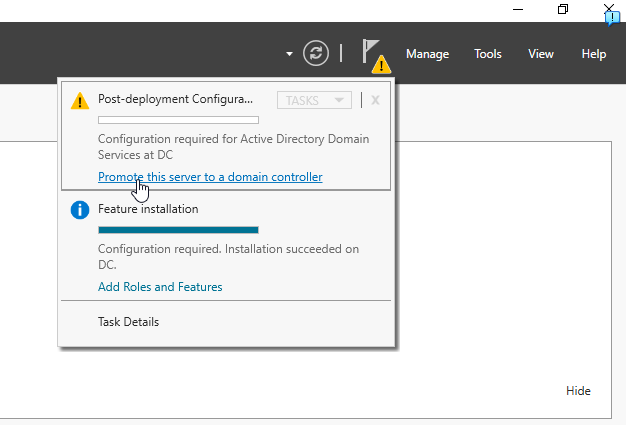

# Using Active Directory

## Table of Contents
- [Installing Active Directory Domain Services (AD DS)](#installing-active-directory-domain-services-ad-ds)
- [Promote the Server to a Domain Controller](#promote-the-server-to-a-domain-controller)
- [Creating Organizational Units (OUs) and Users in Active Directory](#creating-organizational-units-ous-and-users-in-active-directory)
- [Managing Users in Active Directory](#managing-users-in-active-directory)
- [Next Step: Setting Up NAT/RAS](NAT-RAS.md)
- [Back to Active Directory Home Lab README](../README.md)
##

## **Installing Active Directory Domain Services (AD DS)**

### Step 1: Open Server Manager and Select "Add Roles and Features"
1. Launch **Server Manager** from the Start menu or taskbar.
2. Click on **Add roles and features** to open the wizard.

---

### Step 2: Begin the Add Roles and Features Wizard
1. In the **Before You Begin** screen, review the prerequisites:
   - Administrator account has a strong password.
   - Static IP addresses are configured.
   - Latest Windows Updates are installed.
2. Click **Next** to continue.

---

### Step 3: Select the Server Roles
1. Keep clicking **Next** until you reach the **Server Roles** screen.
2. Check **Active Directory Domain Services**.

---

### Step 4: Add Required Features
1. A dialog box will appear asking to add features required for AD DS.
2. Click **Add Features**.

---

### Step 5: Confirm and Install
1. Continue clicking **Next** until you reach the **Confirmation** screen.
2. Review the selected roles and features to ensure everything is correct.
3. Click **Install** to begin the installation process.

---

Once the installation is complete, proceed to the next steps to configure your new domain.

---

## **Promote the Server to a Domain Controller**

### Step 1: Start Post-Deployment Configuration
1. After the installation of Active Directory Domain Services (AD DS) is complete, you will see a **Post-deployment Configuration** notification at the top right of the Server Manager.
2. Click on **Promote this server to a domain controller** to begin the configuration process.

---

### Step 2: Deployment Configuration
1. In the **Deployment Configuration** wizard, select **Add a new forest**.
2. In the **Root domain name** field, enter the desired domain name (e.g., `mydomain.com`).
3. Click **Next** to proceed.

---

### Step 3: Domain Controller Options
1. Enter a **Directory Services Restore Mode (DSRM) password** and confirm it.
2. Click **Next** to until you get to **Prerequisites Check**.

---

### Step 4: Prerequisites Check
1. The wizard will perform a **Prerequisites Check** to validate the configuration.
2. Ensure all prerequisite checks pass successfully.
3. Review the warnings and additional information if applicable.
4. Once all checks are passed, click **Install** to begin the promotion process.

---

## **Explanation**
- **Add a New Forest**:
  - A forest is the highest level of the Active Directory hierarchy. Creating a new forest establishes a new domain.
- **Functional Levels**:
  - Define the features available for the domain and forest.
- **DNS Server**:
  - Enables the server to resolve domain names within the network.
- **Global Catalog (GC)**:
  - Facilitates searching for objects in the directory and speeding up authentication.

Once the server has been promoted to a domain controller, the system will reboot automatically.

---

## Creating Organizational Units (OUs) and Users in Active Directory

### Step 1: Opening Active Directory Users and Computers

1. Click on the **Start Menu**
2. Type **Active Directory Users and Computers** into the search bar.
3. Select the **Active Directory Users and Computers** app from the search results.
   

### Step 2: Create an Organizational Unit (OU)
1. Open **Active Directory Users and Computers**.
2. Right-click on your domain name (e.g., `mydomain.com`) in the left panel.
3. Hover over **New** and select **Organizational Unit**.
   
4. In the **New Object - Organizational Unit** dialog:
   - Enter the name of the OU (e.g., `_ADMINS`).
   - Ensure the box for **Protect container from accidental deletion** is checked.
   - Click **OK** to create the OU.

   

---

### Step 3: Add a New User to the Organizational Unit
1. In **Active Directory Users and Computers**, navigate to the newly created OU (e.g., `_ADMINS`).
2. Right-click the OU and hover over **New**, then select **User**.
   
3. In the **New Object - User** dialog:
   - Enter the user's first name, last name, and user logon name.
   - Example:
     - **First Name**: Luis
     - **Last Name**: van den Bussche
     - **User Logon Name**: `a-vandenbussche`
   - Click **Next** to continue.

   
4. Set the user's password:
   - Enter the password in both fields.
   - Options:
     - Check **User must change password at next logon** if the user should set their password upon first login.
   - Click **Next** to proceed.

   
5. Review the details and click **Finish** to create the user account.

---

### Best Practices for OUs and User Accounts
1. **Organizational Units (OUs)**:
   - Group similar objects (e.g., users, computers) for easier management.
   - Use meaningful names that reflect their purpose (e.g., `_ADMINS`, `HR_Employees`).

2. **User Accounts**:
   - Use consistent naming conventions for usernames.
   - Ensure secure password policies are in place.

These steps ensure efficient management and organization of resources in your Active Directory environment.

---

## Managing Users in Active Directory

### Adding a User to the Domain Admins Group

#### Accessing User Properties
1. In the **Active Directory Users and Computers** window:
   - Navigate to the appropriate Organizational Unit (OU) where the user account is located (e.g., `_ADMINS`).
   - Right-click on the user account (e.g., "Luis van den Bussche").
2. Select **Properties** from the context menu.

---

#### Adding Group Membership
1. In the **Properties** window:
   - Navigate to the **Member Of** tab.
2. Click the **Add...** button.

---

#### Selecting the Group
1. In the **Select Groups** dialog:
   - Type **Domain Admins** into the input box labeled "Enter the object names to select."
   - Click **Check Names** to validate the group.
2. Click **OK** to add the user to the group.

---

#### Confirming Group Membership
1. Verify that **Domain Admins** now appears in the **Member Of** tab under the list of groups.
2. Click **OK** to save and close the **Properties** window.

---

### Logging In as the Updated User

#### Sign Out and Log In as the Updated User
1. Open the **Start Menu**.
2. Click on the **profile icon** or your account name in the bottom-left corner.
3. Select **Sign out** from the menu.

4. On the login screen, select **Other user**.
5. Enter the username and password for the updated account (e.g., "a-lvandenbussche").
6. Ensure the domain is correct (e.g., **MYDOMAIN**).
7. Click the **arrow** button or press **Enter** to log in.

---

[🔝 Back to Table of Contents](#table-of-contents)

##
[Next Step: Setting Up NAT/RAS](NAT-RAS.md)

[Back to Active Directory Home Lab README](../README.md)
##
